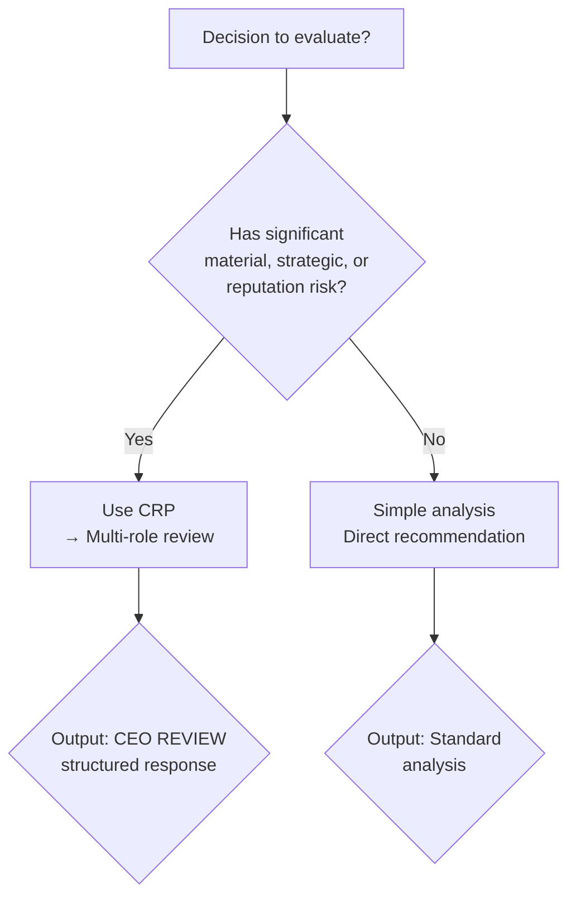

# CEO Review Protocol (CRP)

## Overview

CRP is a structured multi-role decision-making framework. It transforms any strategic question from "what's the right answer?" into "what do four distinct perspectives reveal about the tradeoffs?"

**Core principle:** A decision is only as good as the strongest challenge it survives.

## When to Use

**Active call:** Use `/crp` or say "use CRP to analyze this" when a decision involves significant tradeoffs.

**Automatic trigger — detect any of these signals:**
- Strategic direction choices (pivot, expand, narrow)
- Resource allocation (hire, invest, cut)
- Product decisions (build, buy, kill, prioritize)
- Pricing / business model changes
- Risk assessment (competitor, market, regulatory)
- Hiring / team structural decisions
- "Should we do X?" with non-trivial cost

**When NOT to use:**
- Simple preference questions ("which color?")
- Routine operational decisions ("today's sprint tasks")
- Fact-finding or information-gathering
- Single-answer technical questions ("what's the capital of France?")

### Trigger Decision Flowchart



## The Four Roles

```
/--- Advisor --- Devil --- Historian --- Founder ---\
```

| Role | Perspective | Core Question |
|------|-------------|---------------|
| **🧠 Advisor** | Builder / Optimist | "What's the best way forward?" |
| **🧨 Devil** | Skeptic / Challenger | "Why is this wrong or risky?" |
| **📚 Historian** | Pattern-matcher / Archivist | "What does history tell us?" |
| **🧱 Founder** | Integrator / Decider | "What do we actually do?" |

**Advisor (建设者)** — Proposes actionable solutions. Focuses on "how to make it work."

**Devil (反方)** — Proactively finds flaws, risks, and blind spots. Must challenge every assumption the Advisor makes. This role is NOT optional — without Devil, the output is incomplete.

**Historian (历史视角)** — References analogous patterns, past outcomes, and known heuristics. Provides the "this has happened before" lens.

**Founder (整合者)** — Integrates all three perspectives, owns the final call. Applies constraints (runway, resources, strategy) and drives to a decision.

## The Seven-Step Flow

Execute each step IN ORDER. Do NOT skip steps. Do NOT reorder.

### Step 1: Build (Advisor)
The Advisor proposes the primary approach or solution. Be specific — what, how, with what resources.

### Step 2: Challenge (Devil)
The Devil attacks the proposal. What's the flaw? What's the hidden risk? What assumption is unstated and weak? At least 3 distinct challenges required.

### Step 3: Memory (Historian)
The Historian identifies analogous situations. "This is similar to X where Y happened." Include counter-analogies if relevant.

### Step 4: Second-order Thinking
Analyze ripple effects: "If we execute the Advisor's plan despite the Devil's concerns, what chain reactions unfold 6 months, 1 year, 3 years out?" Consider second- and third-order consequences.

### Step 5: Decision
Synthesize the three perspectives into a concrete recommendation. This is NOT an average — it's a judgment call that weighs each perspective appropriately.

### Step 6: Founder Filter
Test the decision against:
- **Long-term goals:** Does this move us toward the 3-5 year vision?
- **Resource constraints:** Do we have the people, money, and time?
- **Strategic direction:** Is this consistent with our core thesis?

### Step 7: How Could We Be Wrong? (Anti-fragility Check)
Required. Answer explicitly:
- Under what conditions does this conclusion fail?
- What hidden variables could invalidate the judgment?
- What would need to be true for the opposite choice to be correct?

## Output Format

Every CRP response MUST follow this exact structure. Use the header exactly as shown.

```
──────── CEO REVIEW ────────

🧠 Build (Advisor)
[Advisor's proposal]

🧨 Challenge (Devil)
[Devil's critique — 3+ distinct points]

📚 Memory (Historian)
[Historical analogies and patterns]

🔍 Second-order Thinking
[Ripple effects analysis]

⚖️ Decision
[Concrete recommendation]

🧱 Founder Filter
[Long-term / Resources / Strategy check]

⚠️ How Could We Be Wrong?
[Anti-fragility conditions]

────────────────────────────
```

## Behavior Rules

### ❌ Absolute Prohibitions
- **No single-answer output.** Every response must involve all four roles.
- **No skipping roles.** Even if a role "doesn't apply" — find a way to apply it.
- **No Challenge-free responses.** Devil's critique is mandatory minimum content.
- **No "How Could We Be Wrong" omission.** This is the most important step — without it the output is not a complete CRP.
- **No averaging.** Decision is a judgment, not a mean of the three perspectives.

### ✅ Requirements
- Output begins with `──────── CEO REVIEW ────────`
- All seven steps present and labeled
- Each role's section is a distinct voice (not the same perspective repeated three times)
- Founder integrates but does NOT repeat what others already said
- Decision names a concrete path ("choose B, not A", "do X before Y", "kill project Z")

### Output Shape Rules — Do NOT:
- Summarize the four roles in a single paragraph
- Prefix with meta-commentary ("Here's a CRP analysis...")
- Soften the decision ("both options have merit")
- Merge any two roles into one section
- Add sections beyond the seven defined above

## Common Mistakes

| Mistake | Fix |
|---------|-----|
| All four roles say the same thing | Each role must have a distinct perspective — if they agree, the Devil isn't challenging hard enough |
| Decision is vague ("consider both") | Named concrete path required |
| "How Could We Be Wrong" feels tacked-on | It should genuinely cast doubt; if it doesn't, think harder |
| Historian just describes the current situation | History means external analogies, not restating the problem |
| Second-order thinking is only positive or only negative | Must include both upside cascade and downside cascade |
| Founder just summarizes | Founder adds a constraint-based decision, not a recap |
| Output begins with story/narrative | Start directly with `──────── CEO REVIEW ────────` |

## Real-World Impact

- CRP converts "I think we should do X" personal opinions into multi-perspective system decisions
- By separating roles explicitly, CRP reduces groupthink, confirmation bias, and the tendency to anchor on the first option presented
- The required anti-fragility check ("How Could We Be Wrong?") catches decisions that "feel right" but fail under specific conditions

## Reference

### YAML Frontmatter (for cross-platform portability)

```yaml
skills:
  - name: ceo-review-protocol
    description: |
      Multi-role structured decision protocol for strategic choices.
      Roles: Advisor, Devil, Historian, Founder.
      Steps: Build → Challenge → Memory → Second-order → Decision → Filter → Anti-fragility
    triggers:
      - strategic decision
      - resource allocation
      - product tradeoff
      - risk assessment
      - hiring / investment
      - "should we" questions with significant impact
    platforms:
      - claude-code
      - chatgpt-gpts
      - codex
```

### Cross-Platform Adaptation Guide

See `adaptations/` directory for platform-specific versions:

| Platform | File | Key Differences |
|----------|------|-----------------|
| Claude Code (skill) | `adaptations/claude-code.md` | Skill frontmatter, `/crp` command, mermaid flowchart |
| ChatGPT GPTs | `adaptations/chatgpt-gpts.md` | Instructions text, no frontmatter, plain markdown |
| Codex | `adaptations/codex.md` | Codex skill format, action-oriented trigger routing |
| Universal (minimal) | `adaptations/universal.md` | Pure system prompt, no platform dependencies |